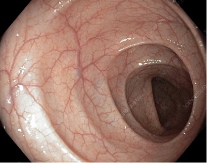
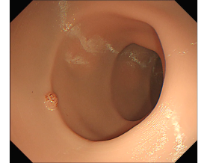

# Colon Region Classification using Optical Flow

This project focuses on automatic classification of colon regions using colonoscopy videos.  
The goal is to support real-time navigation and localization during colonoscopy procedures.

The system utilizes optical flow features extracted from colonoscopy video frames to capture motion patterns inside the colon.

Both **real colonoscopy videos** and the **Mikoto colonoscopy simulator** were used for model training and evaluation.

---

# Overview

Colonoscopy is a key procedure for detecting colorectal diseases such as polyps and colorectal cancer.  
However, accurately identifying the current region of the colon during the procedure can be difficult.

This project aims to develop an AI system that can automatically classify colon regions based on video input.

The approach leverages motion information extracted from colonoscopy videos to improve region classification performance.

---

# Dataset

Two types of datasets were used:

### Real Colonoscopy Data
Videos collected from real colonoscopy procedures.

### Mikoto Colon Simulator
Synthetic colonoscopy videos generated from the Mikoto training simulator.

Example dataset frames:

---

# Method

The proposed approach uses **optical flow** to capture motion patterns between consecutive frames in colonoscopy videos.

Optical flow is computed using **RAFT (Recurrent All-Pairs Field Transforms)**, a state-of-the-art deep learning method for dense optical flow estimation.

The extracted motion information is then used as input to a deep neural network for colon region classification.

The workflow is as follows:

1. Extract video frames from colonoscopy recordings
2. Compute optical flow between consecutive frames using **RAFT**
3. Generate motion representations from optical flow
4. Use the motion features as input to a classification network
5. Predict the colon region

---

# Model Pipeline

The pipeline consists of the following steps:

1. Colonoscopy video input
2. Optical flow extraction using **RAFT**
3. Feature extraction using **EfficientNet**
4. Colon region classification

EfficientNet was used as the backbone network due to its strong performance and computational efficiency, enabling real-time inference.

---

# Real-Time Inference

The model was designed to support **real-time colon region classification** during colonoscopy procedures.

EfficientNet enables efficient feature extraction, while RAFT provides accurate motion estimation from video frames.  
This combination allows the system to classify colon regions during the procedure.

---

# Results

The model achieved strong performance in classifying colon regions from colonoscopy videos.

Evaluation metrics include:

- Accuracy
- Confusion Matrix
- Per-region classification performance

---

# Key Technologies

- **RAFT** for optical flow estimation
- **EfficientNet** for visual feature extraction
- Deep learning-based colon region classification
- Real-time inference from colonoscopy video

